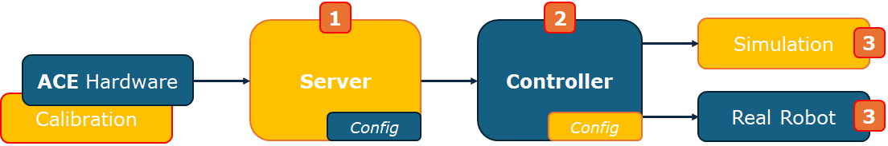
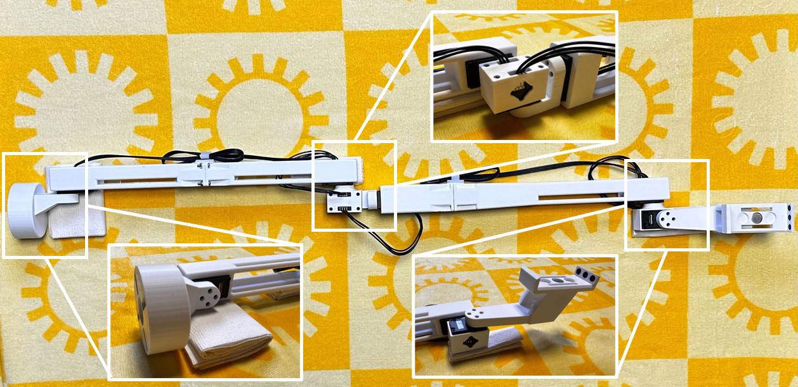
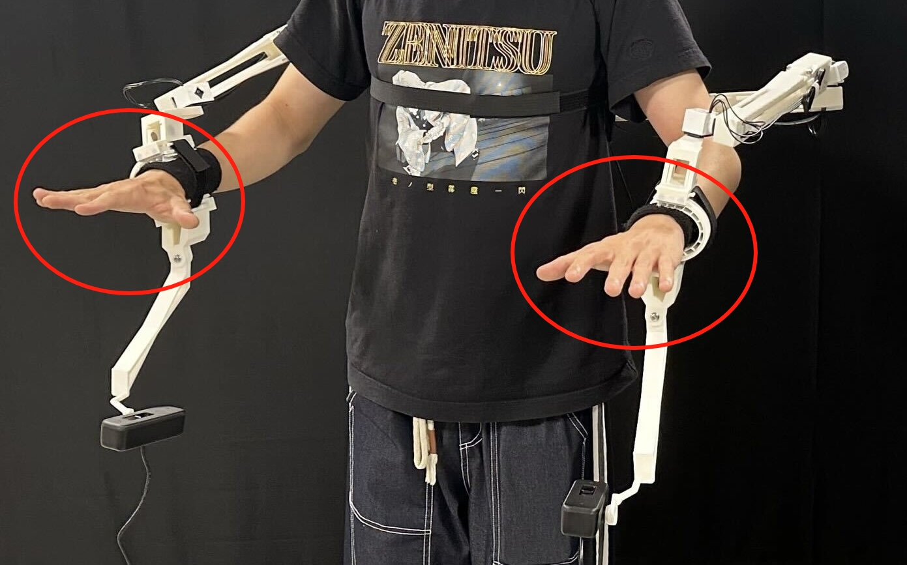

<h1 align="center"> ACE: A Cross-platform Visual-Exoskeletons
for Low-Cost Dexterous Teleoperation </h1>

<p align="center">
    <a href="https://aaronyang1223.github.io/" style="font-size: 20px;">
        Shiqi Yang
    </a>
    ·
    <a href="https://minghuanliu.com" style="font-size: 20px;">
        Minghuan Liu
    </a>
    ·
    <a href="https://yzqin.github.io" style="font-size: 20px;">
        Yuzhe Qin
    </a>
    ·
    <a href="https://dingry.github.io" style="font-size: 20px;">
        Runyu Ding
    </a>
    ·
    <a href="https://ace-teleop.github.io" style="font-size: 20px;">
        Jialong Li
    </a>
    <br>
    <a href="https://chengxuxin.github.io" style="font-size: 20px;">
        Xuxin Cheng
    </a>
    ·
    <a href="https://rchalyang.github.io" style="font-size: 20px;">
        Ruihan Yang
    </a>
    ·
    <a href="https://www.cs.cmu.edu/~shayi/" style="font-size: 20px;">
        Sha Yi
    </a>
    ·
    <a href="https://xiaolonw.github.io" style="font-size: 20px;">
        Xiaolong Wang
    </a>
</p>

<p align="center">
    
</p>

<p align="center">
<h3 align="center"><a href="https://ace-teleop.github.io/">Website</a> | <a href="http://arxiv.org/abs/2408.11805">arXiv</a> | <a href="https://github.com/ACETeleop/ACE_hardware">Hardware</a> </h3>
  <div align="center"></div>
</p>

<p align="center">

</p>

## Introduction

The repository contains all the software for **ACE**, which includes three main components: server, controller, and simulation. Additionally, we provide utilities to set up the hardware. Combined with ACE hardware, you can quickly teleoperate with various end-effectors and robots in the simulation environment or use commands from the controller to operate robots in the real world. See the ACE hardware repository for the STL files and hardware instructions for building your own <a href="https://github.com/ACETeleop/ACE_hardware">**ACE**</a>.

### Key Components
- **Server:** Accepts hand images and joint angles as inputs, and outputs the wrist pose and hand key points after mapping.
- **Controller:** Processes inputs from the server and uses inverse kinematics (IK) to generate control commands.
- **Simulation:** Receives commands and visualizes the actions within the simulation environment.

### Supported Robots and End-Effectors 
- **xArm** with **Ability Hand**
- **Franka** with **Gripper**
- **H1** with **Inspire Hand**
- **GR-1** with **Gripper**

Welcome to update and expand the list of supported robots and end-effectors!

## Prepare:
```python
pip install -e .
```

## Teleop Workflow
<p align="center">
    
</p>

The system is easy to use with only three steps to control various end-effectors and robots.

1. **Calibrate the Hardware:** Follow the instructions to [calibrate](#calibration) the hardware.
2. **Start teleop:** 
   - [Start the server](#ace-server).
   - If you need to control the robot in the [simulation](#simulation), simply run `teleop_sim.py`.
   - If you need to control a [real robot](#ace-controller), modify `teleop_cmd` and connect it with the real robot control code.

**Note:** 
1. The teleoperation system will automatically map rotation and position, then start after [initialization](#initialization). The initialization process begins when the hands are held still with fingers spread out flat.
2. Server and controller need corresponding configs.

<p id="ace-server"></p>

## ACE Server (Get Input from ACE Hardware or Your Keyboard)

### Start Server
If you just want to see how the code works, you can have fun with your keyboard:
```python
python3 scripts/start_server.py --config h1_inspire --keyboard
```
You can use `wasd` to control the left wrist and `↑←↓→` to control the right wrist after running the `teleop_sim` code (see below). Note: the control signal is sent from the server side, therefore the foreground window must be the terminal running the above script.

If you have a set of ACE teleoperation hardware, try:
```python
# for normal mode
python3 scripts/start_server.py --config h1_inspire

# for mirror mode
python3 scripts/start_server.py --config h1_inspire_mirror

```
<p id="ace-controller"></p>

## ACE Controller (Get Input from the server)

### Run Controller
```python
# used to get the command
python scripts/teleop_cmd.py --config h1_inspire
```

<p id="simulation"></p>

## Simulation (Get input from the controller)

### Running in Simulation

We provide the code for controlling robots in simulation. You can easily use the simulation to test the configuration before controlling the robot in the real world.

```python
# Install isaacgym if you want to run the sim example.
python scripts/teleop_sim.py --config h1_inspire
```

<p id="calibration"></p>

## Calibration

### Update Motor IDs

Install the [dynamixel_wizard](https://emanual.robotis.com/docs/en/software/dynamixel/dynamixel_wizard2/).

By default, each motor has the ID 1. In order for multiple dynamixels to be controlled by the same U2D2 controller board, each dynamixel must have a unique ID. ACE has six servos, from the base to the wrist, and their IDs should be set from 1 to 6. This process must be done one motor at a time.

**Steps:**
 - Connect a single motor to the controller and connect the controller to the computer.
 - Open the dynamixel wizard and click scan to connect to the motor.
 - Change the motor ID address from 1 to the target ID (1 to 6) for each servo.
 - Repeat the process for each motor, assigning a unique ID from 1 to 6.

### Get Offset

After setting the motor IDs, you can connect to the ACE hardware. However, each motor has its own joint offset, leading to discrepancies between your ACE hardware and the ACE URDF. Dynamixels have a symmetric 4-hole pattern, resulting in joint offsets that are multiples of π/2. To address this, you can use the following code to calibrate your ACE hardware. 

- **Port:** Find the port ID of your U2D2 Dynamixel device by running `ls /dev/serial/by-id` and looking for the path that starts with `usb-FTDI_USB__-__Serial_Converter` (on Ubuntu). On Mac, look in /dev/ for the device that begins with `cu.usbserial`.

- **Type:** Specify which arm you are calibrating.

```python
# Set the ACE hardware to the pose shown in the following picture, then run the code
python3 -m ace_teleop.dynamixel.calibration.get_offset --port /dev/serial/by-id/usb-FTDI_USB__-__Serial_Converter_FT8J0QI3-if00-port0 --type left
```

<p align="center">

</p>

After getting the offset, go to `ace_teleop/dynamixel/calibration/config.py` and add a `DynamixelRobotConfig` to the `PORT_CONFIG_MAP`. Note: You only need to copy an existing config from the file and modify the `port` and `joint_offsets` as required.

### Test Calibration

After calibration, you can test the result with the following command. You should see the ACE hardware in the real world behave the same way as it does in the simulation.

```python
# Note: test_calibration requires sapien==3.0.0b0, which may conflict with dex_retargeting==0.1.1.
# It's recommended to create a separate environment to avoid potential errors.
python -m ace_teleop.dynamixel.calibration.test_calibration --port /dev/serial/by-id/usb-FTDI_USB__-__Serial_Converter_FT8J0QI3-if00-port0 --type left
```

After testing the calibration, go to `ace_teleop/configs/server` and change the `port` in the corresponding `yml` file.

### Find Cam index and test the Cam FPS
This code will find all the webcams and show the fps.
```python
# press "k" to show next cam
python3 -m ace_teleop.tools.find_webcam
```
After getting the webcam index, go to `ace_teleop/configs/server` and change the `cam_num` in the corresponding `yml` file.

## Details

With default configurations and auto mapping, you can easily control the provided robots. The following details may help you get the full use of **ACE** and better handle different tasks.

<p id="initialization"></p>

### Initialization

- **Bimanual Configs:** The following pose will start initialization. If the operator's hands are not held still or if the fingers are not spread out flat, the initialization process will restart.

<p align="center">

</p>

- **Single Arm Configs:** Press "p" to initialize.

### Mapping Controls

- **r:** Remap the current human rotation to the set robot rotation.
- **p:** Remap the current human position to the set robot position.
- **m:** First press: the robot will keep still. Second press: remap the current human pose to the current robot pose.
- **x:** First press: lock x-axis movement. Second press: unlock x-axis movement.
- **y:** First press: lock y-axis movement. Second press: unlock y-axis movement.
- **z:** First press: lock z-axis movement. Second press: unlock z-axis movement.

### Configs

To better control the robot, go to `ace_teleop/configs/server` and modify `pos_scale`, `roll_scale`, `pitch_scale`, `yaw_scale` in the corresponding `yml` file.


## Acknowlegments
This code base refers a lot to many previous amazing works like [BunnyVisionPro](https://github.com/Dingry/bunny_teleop_server), [OpenTeleVision](https://github.com/OpenTeleVision/TeleVision), [GELLO](https://github.com/wuphilipp/gello_software). Also, the codes are built on some superior public project, such as [pinocchio](https://github.com/stack-of-tasks/pinocchio) and [dex-retargeting](https://github.com/dexsuite/dex-retargeting).
